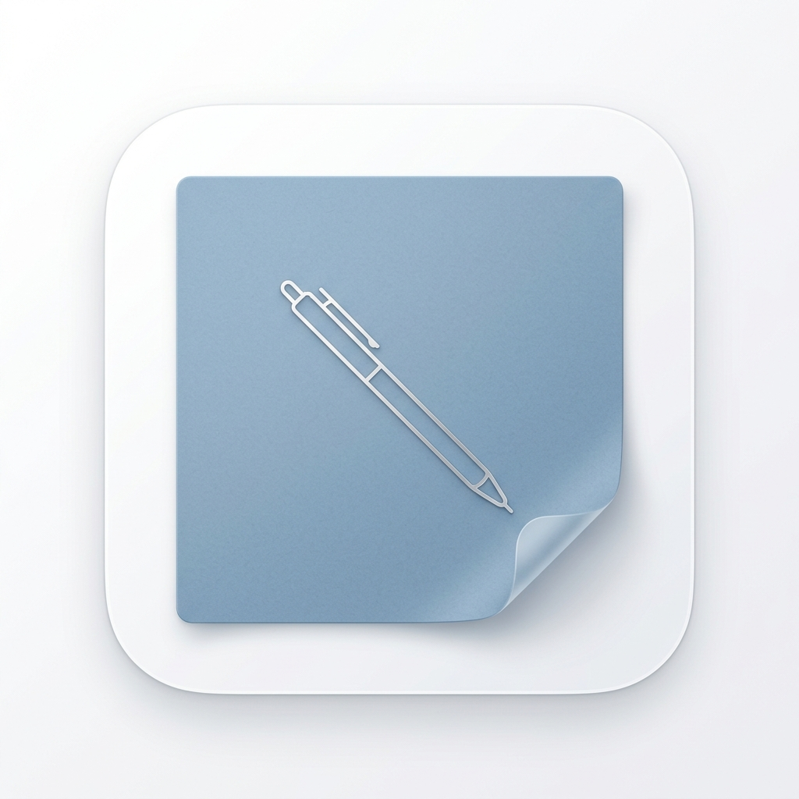

# 学习搭子 (Academic Buddy)

> **“独学而无友，则孤陋而寡闻。”**
> 在这里，不看排名，不比分数，只寻找那个能和你一起在图书馆坐到天黑的伙伴。

---

## 嘿！欢迎来到这里

这是一个为你精心打造的学术社交小角落。我们讨厌冷冰冰的列表，所以我们把需求做成了**一张张会飘落的纸条**；我们拒绝竞技带来的焦虑，所以这里只有**真诚的互助与陪伴**。

### 为什么你会喜欢它？

- **纸条广场**：每一张贴纸都是一个诚挚的邀约，纸条入场时还会有可爱的重力感哦！
- **名片互通**：不再有那种“加了好友却不说话”的尴尬，互通成功后直接开启高效模式。
- **超清爽视觉**：毛玻璃质感搭配莫兰迪色系，保护你的双眼，也让心情变得很 Chill。
- **安全小卫士**：30天自动过期逻辑和举报系统，让广场永远只有最新、最清爽的能量。

### 项目里有些什么？

- **首页 (Index)**：你可以像逛留言墙一样寻找你的伙伴。
- **发布 (Publish)**：随手贴上一张属于你的彩色纸条。
- **消息 (Notifications)**：在这里管理你发出的邀约和收到的惊喜。
- **名片 (Profile)**：展示最真实的自己，让对的人找到你。

---

*更深层的设计思路都在 [DESIGN_HALL.md](./DESIGN_HALL.md) 里，欢迎考古！*

---

🎉 **祝每一个努力学习的魂儿，都能在这里找到同频的搭子。**
*Academic Buddy © 2026. 纯粹、简单、共同成长。*
